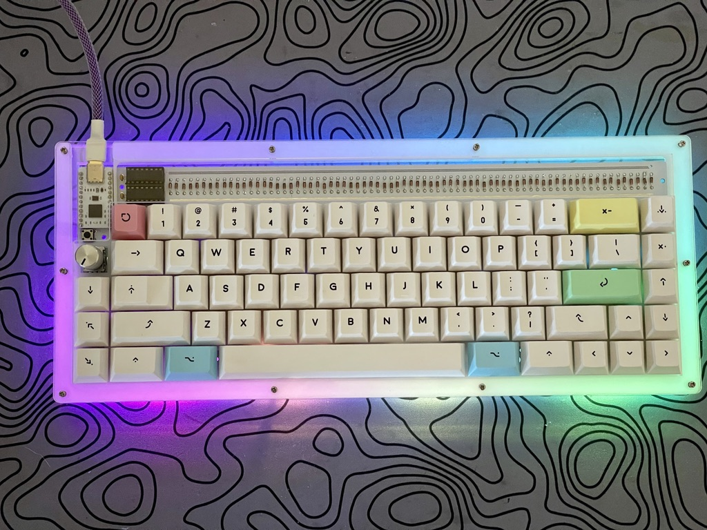

# NIBBLE65 Acrylic Case

## Case Information
USB Cutout is meant to be used with a thin style USB cable, like [this one.](https://www.amazon.com/gp/product/B08M16YSTB/ref=ppx_yo_dt_b_search_asin_title?ie=UTF8&psc=1) If you choose to use a larger cable, it won't fit right.

This case is not compatible with your NIBBLE65 **if you've already soldered switches.** You'll have to desolder the switches if you want to use this case.

My recommendations for what color acrylic and POM to use are listed below. If you choose something other than clear for L7 then you won't be able to see the diodes, ICs, and BIT-C.

The TRRS connectors are not exposed in this case. They will be included in future revision.

### Layers
#### Mandatory Layers
* L0: Bottom layer (3mm frosted acrylic) - 343.85mm x 140.25mm
* L1: Closed layer (3mm clear acrylic) - 343.85mm x 140.25mm
* L2: Closed layer (3mm clear acrylic) - 343.85mm x 140.25mm
* L3: Closed layer (3mm clear acrylic) - 343.85mm x 140.25mm
* L4: USB Cutout layer (3mm clear acrylic) - 343.85mm x 140.25mm
* L5: Switch Plate (1.5mm white POM) - 343.85mm x 140.25mm
  * This layer needs to be 1.5mm and needs to be POM. I've found POM to be the best material at this width. I tried 1.5mm acrylic plates and they cracked when putting switches in. Use acrylic at your own risk.
* L6: USB Cutout layer (3mm clear acrylic) - 343.85mm x 140.25mm
* L7: Top layer (3mm clear acrylic) - 343.85mm x 140.25mm

#### Optional Layers
* F0: Foot farthest from case (3mm acrylic) - 307.61mm x 12mm
* F1: Middle foot (3mm acrylic) - 311.61mm x 16mm
* F2: Foot closest to case (3mm acrylic) - 315.61mm x 20mm

## Hardware Needed
* 20x M2x8mm screws ([for example](https://www.amazon.com/gp/product/B01B1OD0D2/ref=ppx_yo_dt_b_asin_title_o04_s00?ie=UTF8&psc=1))
* 10x M2x15mm standoffs ([for example](https://www.amazon.com/gp/product/B08LCXXZ16/ref=ppx_yo_dt_b_asin_title_o00_s00?ie=UTF8&psc=1))

## Optional Hardware
* Bumpons ([for example](https://www.amazon.com/gp/product/B001JAW454/ref=ppx_yo_dt_b_search_asin_title?ie=UTF8&psc=1))
* 3x M2x4mm standoffs for feet

## Getting one
* Option 1: Use the files in repo with a cut on demand service like Ponoko. 
* Option 2: [Buy one from me here on Etsy](https://www.etsy.com/listing/1053418292/nibble-acrylic-case-with-pom-plate?ref=shop_home_active_1&frs=1)

## About the files
These files are provided for noncommercial purposes. Use them to make yourself or your friend a nice case. 

## About the project
Thank you to Jay Greco for allowing me to use his files as the starting point for this project. Thank you to tiimzy for the early support. Thank you to Extra Fox for fixing my files.

## Wanna buy a NIBBLE65?
https://nullbits.co

